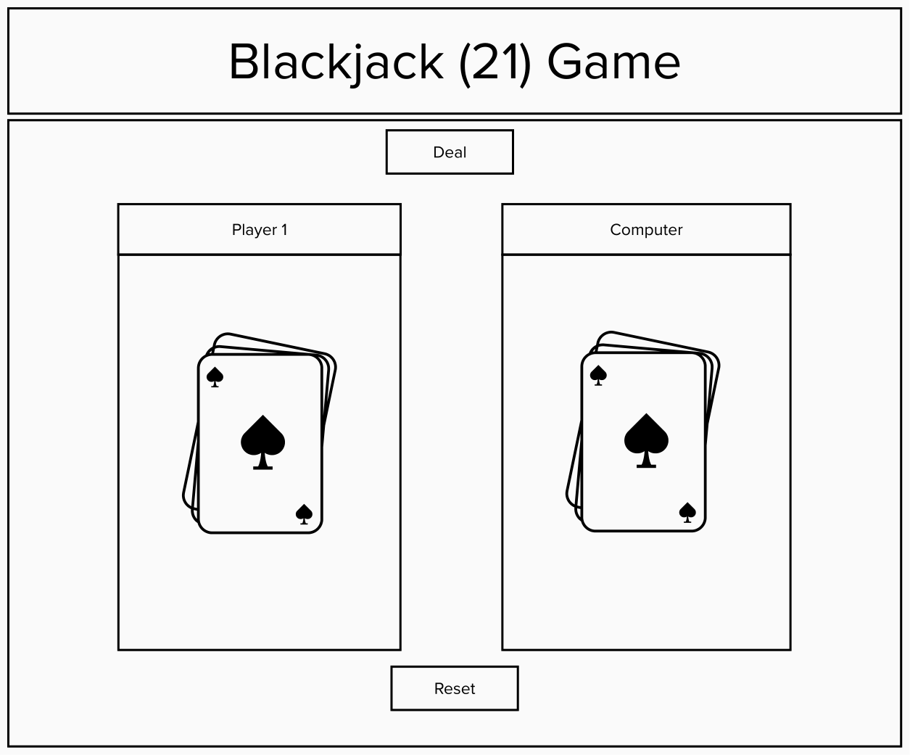

# Blackjack (21) Game

Using the deck of cards API I will create a version of the game BlackJack a.k.a 21. The object of the game is to get to 21 and/or as close to 21 to win, anything over 21 you lose. Cards are dealt at random and either Player can win or draw.  

How to play:
Click on deal to generate a card for player 1 and the computer. Hitting deal again will generate the next card for a "Hit Me". Player will continue until someone wins. 

### Technologies Used

- HTML
- CSS
- JavaScript
- jQuery
- Deck of Cards Api

### Screenshots

### Deck of Cards API Link:
https://deckofcardsapi.com/

### Link to My Project
https://project-1-blackjack-3bsp2kx91-camacho-a.vercel.app/
